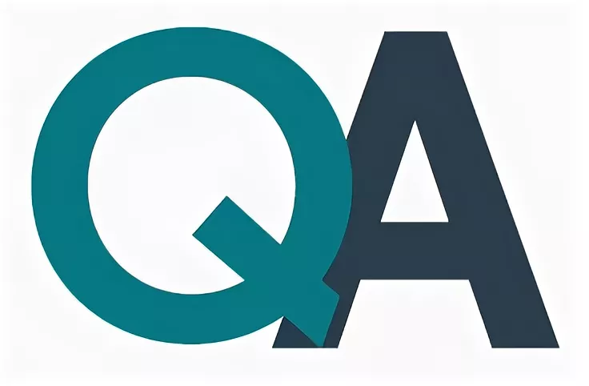

## ***Привет!***
## ***Я Ирина, начинающий QA-инженер.***
## ***Активно ищу возможность применить свои знания и опыт в IT-сфере.***

## ***Мои контакты:***

## ***Инструменты:***
    Mind Map (Xmind)
    Postman (GET, POST, PUT, DELETE запросы)
    CharlesProxy
    Jira
    GitHub, Git
    Qase.io
    Notion
    JavaScript
    Selenium
    Visual Studio Code
    Intellij IDEA
    DevTools
    HTML/CSS

## ***Навыки:***
    Знание теории тестирования;
    Знание техник тест-дизайна;
    Работа с требованиями;
    Понимание современных методологий разработки и жизненного цикла ПО;
    Умение анализировать результаты тестирования и составлять отчеты о тестировании;
    Функциональное и нефункциональное тестирование;
    Позитивное и негативное тестирование;
    Кроссбраузерное тестирование;
    Основы Python;
    Составление тестовой документации: тест-кейс, чек-лист, тест-план;
    SQL (на уровне составления простых запросов)

